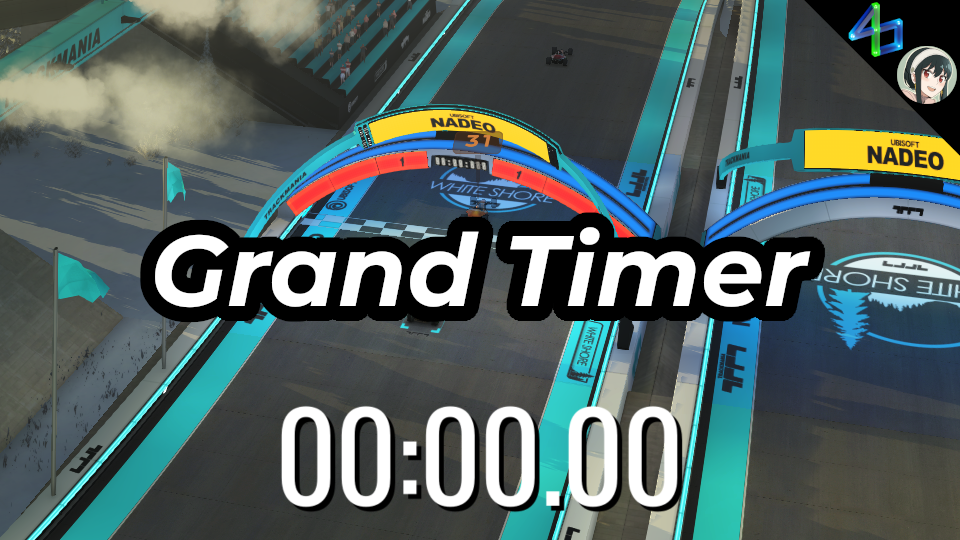

# Grand Timer

Enables the chronometer (timer) on maps with clones enabled (namely Weekly Grands).

Although no code was actually used, permission was given to do so from the plugin [HUD Picker](https://openplanet.dev/plugin/hudpicker).

